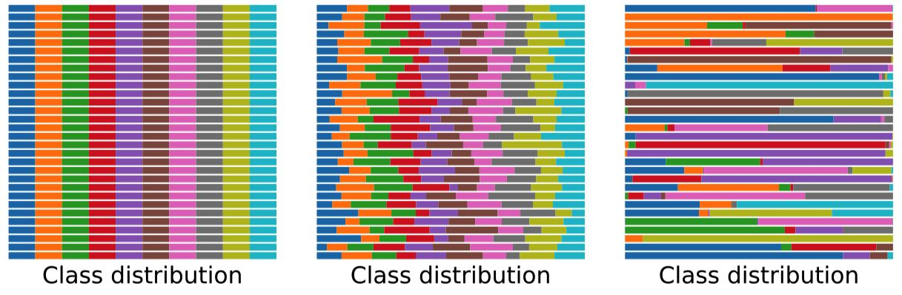

[lokinko/Federated-Learning: 联邦学习 (github.com)](https://github.com/lokinko/Federated-Learning)

## Federated Meta-Learning

### Federated Meta-Learning for Fraudulent Credit Card Detection

任务：本文将元学习的思想与联邦学习相结合，用于解决信用卡欺诈检测问题。

思路：将神经网络分割未Feature Extraction Model 和 Relation model两部分。

- 输入数据通过Feature Extraction Model将数据映射至低维特征空间，并通过参数学习将不同标签的数据的映射差异加大。
- 基于联邦学习的架构结合元学习思想学习Relation Model部分。

## 异构性

> [「联邦学习」— Personalization 技术 - 知乎 (zhihu.com)](https://zhuanlan.zhihu.com/p/354527722)

### 0 Non-IID 

Federated Visual Classification with Real-World Data Distribution

Non-IID的体现：

- 用户的习惯、个性化，地理未知等都会导致设备中的数据分布不同
- 与传统的机器学习中基于batch的批次训练不同，联邦学习每轮训练获取的数据量都会有所差异。
  - Non-Identical Class Distribution: 不同设备的样本类别所占比例不同。
  - Imbalanced Client Size: 不同设备提供的样本数量不同。

相关工作：

- 人工生成Non-IID数据集：为了获取并研究Non-IID数据集，通过手动划分数据集。
- 现实世界中的Non-IID数据集：Shakespeare 和 Stack Overflow数据集包含按照每位用户的id划分的文本数据、

相关方法：

- Federated Averaging and Server Momentum
  - FedAvg
  - FedAvgM
- Importance Reweighted Client Objectives
  - FedIR
- Splitting Imbalanced Clients with Virtual Clients
  - FedVC：将规模较大的 client 拆分为多个较小的客户端，然后重复多次，以使所有虚拟客户端的大小相似。

> IID torch实现案例：[「联邦学习」— FedAvg 的 Pytorch 实现(搬运) - 知乎 (zhihu.com)](https://zhuanlan.zhihu.com/p/259806876)

### 1 FedGen

问题：基于蒸馏的FL很好的解决了用户异构的问题，但是知识蒸馏依赖于代理数据集，且代理数据集的质量也影响蒸馏的表现。User heterogeneity has imposed significant challenges to FL, which can incur drifted global models that are slow to converge.   

解决方法：

- Knowledge Distillation: by refining the server model using aggregated knowledge from heterogeneous users, other than directly aggregating their model parameters. 
  - 聚合知识而不是聚合模型参数
  - 缺点：depends on a proxy dataset
    - making it impractical unless such prerequisite is satisfied
    - Moreover, the ensemble knowledge is not fully utilized to guide local model learning, which may in turn affect the quality of the aggregated model  
- data-free knowledge distillation
  - server: the server learns a lightweight generator to ensemble user information in a data-free manner, which is then broadcasted to users, regulating local training using the learned knowledge as an inductive bias. 
  - 本文提出：通过学习一个数据生成器，对数据集作增广，削弱异构联邦带来的影响。

相关工作：

- FedAvg

挑战：

- data heterogeneity：Along with its promising prospect, FL faces practical challenges from data heterogeneity (Li et al., 2020b), in that user data from real-world is usually non-iid distributed, which inherently induces deflected local optimum (Karimireddy et al., 2020). 
- model heterogeneity: Moreover, the permutation-invariant property of deep neural networks has further increased the heterogeneity among user models (Yurochkin et al., 2019; Wang et al., 2020b).  

参数化变量：

- 传统的优化方式参数化
- 基于联邦学习的参数化
- 知识蒸馏的参数化
- 将联邦学习和知识蒸馏结合以解决数据异构的问题 
  - 通过使用来自异构用户的聚合知识来优化全局模型，而不是直接聚合用户的模型参数。
  - 但是这种方式存在一定的限制：dependence on  a proxy dataset (代理数据集的选择影响了优化的性能)

模型架构方法：

- 服务器学习一个轻量化生成器（仅从用户模型的预测规则中学习），以data-free的方式集成用户信息，然后广播给用户，使用学习到的知识作为归纳偏置来调节局部训练（用从“潜在空间（生成器的分布空间）”采样得到的增广样本分发他们的模型）。
- 优点：
  - 算法只从用户局部模型的预测层提取知识，不依赖与用户的其他数据
  - 不同于其他优化全局模型的方法，该算法使用提取的知识对局部模型施加归纳偏置，直接调节局部模型的更新，该模型在Non-IID下具备更好的泛化性能。
  - 与现有技术相对，该方法通过更多的通信轮次却能产生更号的泛化性能的全局模型。
  - 通过增广数据削弱non-iid的影响，从而间接提升联邦平均模型的表现：采用生成器生成增广数据集增加样本数量的同时，**降低client间数据分布的差异。**

> code: [zhuangdizhu/FedGen: Code and data accompanying the FedGen paper (github.com)](https://github.com/zhuangdizhu/FedGen)

### 2 HeteroFL 

问题：heterogeneous clients  with different computation and communication capabilities.

> code: [dem123456789/HeteroFL-Computation-and-Communication-Efficient-Federated-Learning-for-Heterogeneous-Clients: HeteroFL: Computation and Communication Efficient Federated Learning for Heterogeneous Clients (github.com)](https://github.com/dem123456789/HeteroFL-Computation-and-Communication-Efficient-Federated-Learning-for-Heterogeneous-Clients)

### 3 DVW

both under synchronous and asynchronous communication protocols in data and computationally heterogeneous environments.

> code: [ramshi236/Accelerated-Federated-Learning-Over-MAC-in-Heterogeneous-Networks: SCAFFOLD and FedAvg implementation (github.com)](https://github.com/ramshi236/Accelerated-Federated-Learning-Over-MAC-in-Heterogeneous-Networks)

### 4 SPATL

SPATL: Salient Parameter Aggregation and Transfer Learning for Heterogeneous Clients in Federated Learning

> code: [anonymous429/SPATL: SPATL: Salient Prameter Aggregation and Transfer Learning for Heterogeneous Federated Learning (github.com)](https://github.com/anonymous429/SPATL)

### 5 Federated Learning with Only Positive Labels

任务：在标签分布极端的Non-IID的情况下进行联邦学习。即探讨了在联邦学习分类问题中，当每个Client仅拥有一类数据（postive labels）时模型应该如何学习的方法（*Federated Averaging with Spreadout*）。

## QA

### 4 FedMatch

> [Chriskuei/FedMatch: CIKM 2021 Full Paper: FedMatch: Federated Learning Over Heterogeneous Question Answering Data (github.com)](https://github.com/Chriskuei/FedMatch) 

## Recommendation

### FedFast

任务：将联邦学习与推荐系统相结合

- 现有的基于FedAvg算法训练推荐系统存在收敛速度慢、准确率不高的问题

解决方案：FedFast，加速收敛、低带宽

- ActvSAMP更好的选择每轮的训练参与者
- ActvAGG以更好的方法合并训练模型从而加速模型收敛

## private

### Deep Leakage from Gradients

任务：如何根据梯度信息还原训练数据（梯度泄露）

方法：梯度还原训练元数据的方法：the Deep Leakage from Gradients（DLG）

### Generative Models for effective ml on private, decentralized datasets.

- 使用联邦学习方法训练了一个具有差分隐私保护的生成模型，能在不直接查看数据的情况下生成具有代表性、真实性的合成数据。
- 研究了对于文本和图像数据问题的生成模型：Differentially Private Federated RNNs（DP-FedRNN）、Differentially Private Federated GANs（DP-FedAvg-GAN）.

> 参考：[(56 封私信 / 81 条消息) 无知者 - 知乎 (zhihu.com)](https://www.zhihu.com/people/ceng-xian-sen-43/posts?page=1)
>
> [联邦学习诞生1000天的真实现状丨万字长文 | 雷峰网 (leiphone.com)](https://www.leiphone.com/category/DataSecurity /rfPSGIjbS38DqTsm.html)
>
> [联邦学习系列（一） | 概念介绍 - 知乎 (zhihu.com)](https://zhuanlan.zhihu.com/p/265064016)
>
> [联邦学习系列（三） | 分布式架构 - 知乎 (zhihu.com)](https://zhuanlan.zhihu.com/p/270329595)