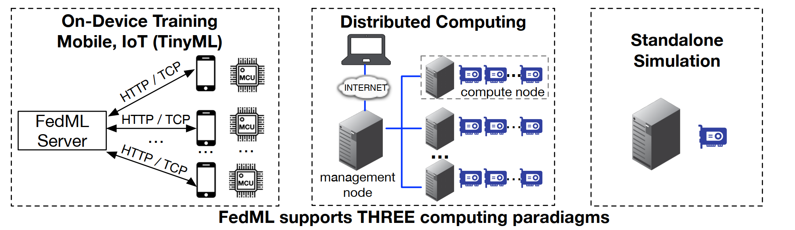
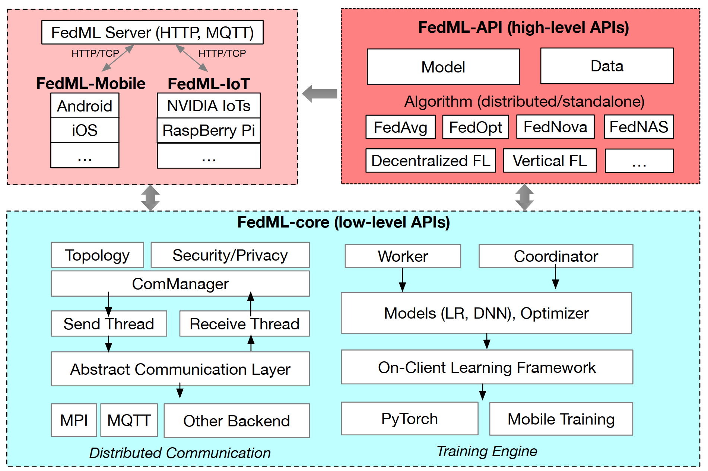
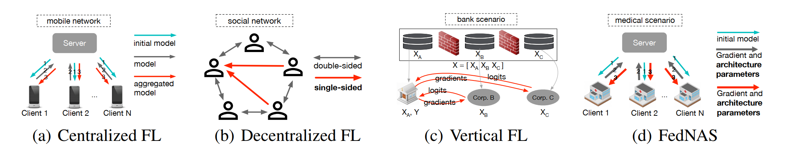
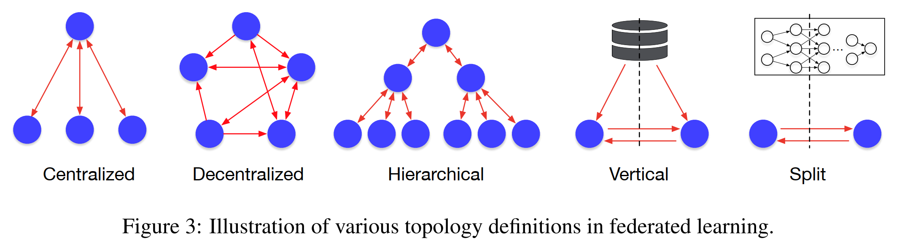
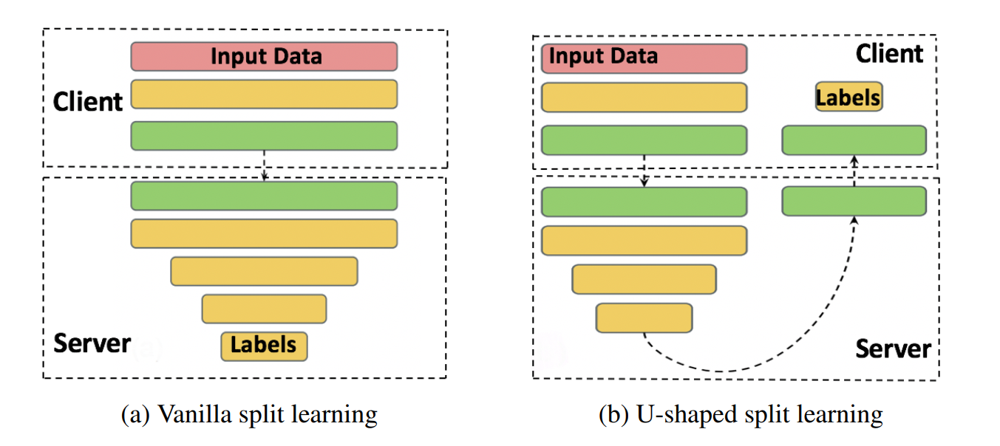
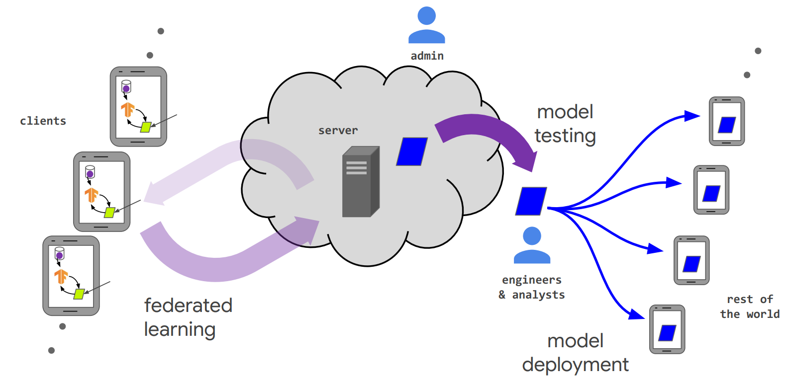
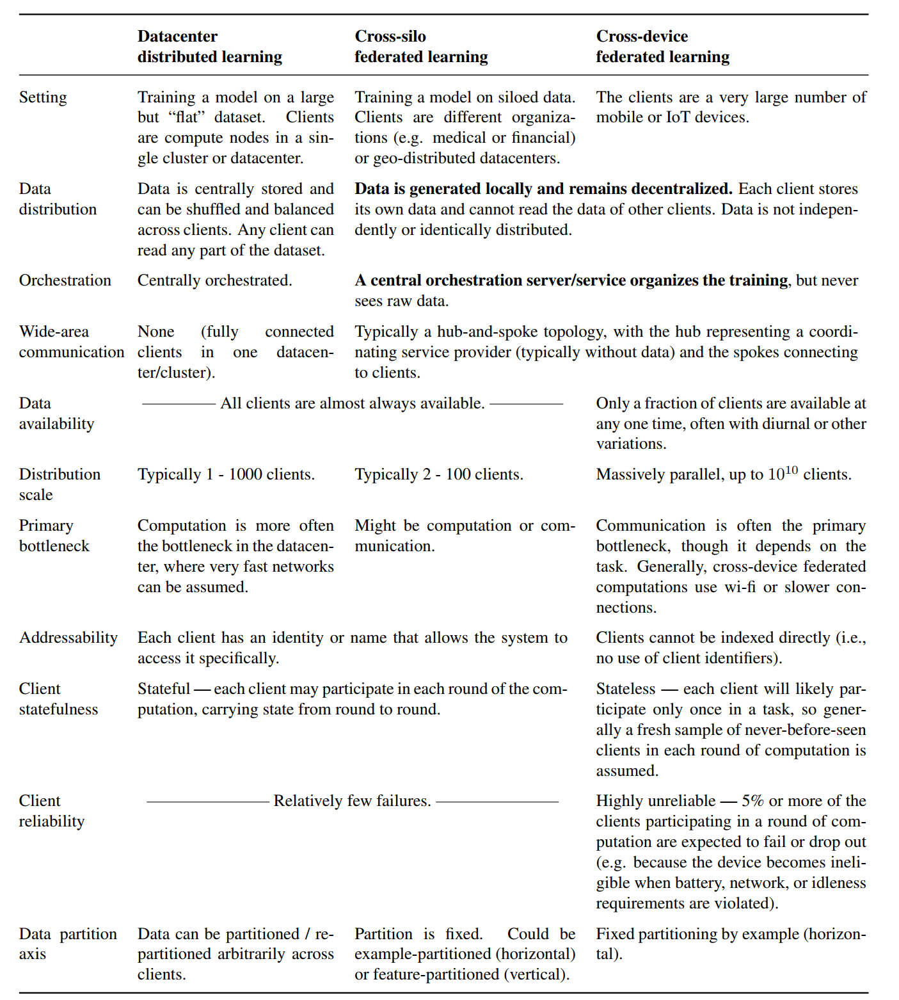
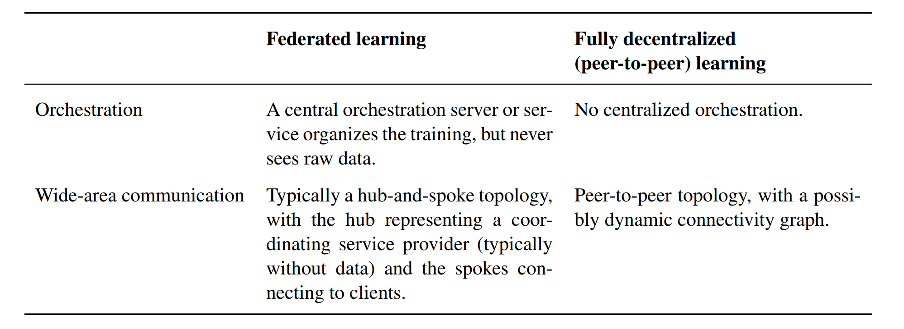
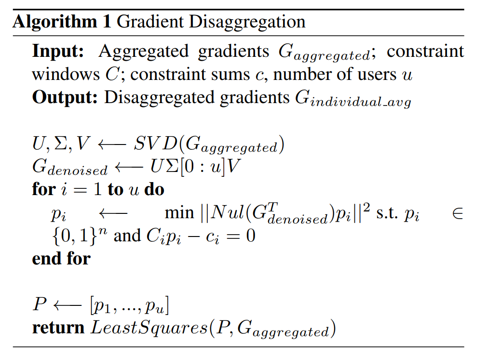

# 1 basic

## 1.1 FL libraries   

### 1.1.1 FedML [link](https://fedml.ai)

**contribution:**

- FedML supports three computing paradigms: on-device training for edge devices, distributed computing, and single-machine simulation.   
- FedML also promotes diverse algorithmic research with flexible and generic API design and comprehensive reference baseline implementations (optimizer, models, and datasets).   
  - Support of diverse FL computing paradigms.   One key feature of FedML is its support of FL on real-world hardware platforms.   
  - Support of diverse FL configurations.   
  - Standardized FL algorithm implementations.  
  - Standardized FL benchmarks.   
  - Fully open and evolving.  

**Introduction:**

- FL differs from data center-based distributed training in three major aspects: 
  - 1) statistical heterogeneity
    - Adaptive Federated Optimizer [2], FedNova [3], FedProx [4], and FedMA [5]   
  - 2) system constraints
    - sparsification and quantization techniques to reduce the communication overheads and computation costs during the training process [6, 7, 8, 9, 10, 11, 12].  
  - 3) trustworthiness.   
    - focuses on developing new defense techniques for adversarial attacks to make FL robust [13, 14, 15, 16, 17, 18, 19, 20, 21, 22, 23, 24, 22], and proposing methods such as differential privacy (DP) and secure multiparty computation (SMPC) to protect privacy [25, 26, 27, 28, 29, 30, 31, 32, 33].  
- Existing efforts are confronted with a number of limitations that we argue are critical to FL research:
  - Lack of support of diverse FL computing paradigms.  
    - simulation-oriented FL libraries: Tensorflow-Federated(TFF),PySyft,LEAF
      - with simulation in a single machine, making them unsuitable for FL algorithms which require the exchange of complex auxiliary information and customized training procedure.  
    - Production-oriented  FL libraries : FATE,PaddleFL
      - they are not designed as flexible frameworks that aim to support algorithmic innovation for open FL problems  
  - Lack of support of diverse FL configurations  
    - In terms of network topology  ,vertical FL [44, 45, 46, 47, 48, 49, 50], split learning [51, 52], decentralized FL [53, 54, 55, 56],  hierarchical FL [57, 58, 59, 60, 61, 62], and meta FL [63, 64, 65]   
    - In terms of exchanged information, besides exchanging gradients and models, recent FL algorithms  propose to exchange information such as pseudo labels in semi-supervised FL [66] and architecture parameters in neural architecture search-based FL  
    - In terms of training procedures, the training procedures in federated GAN [70, 71] and transfer learning-based FL [72, 73, 74, 75, 76]  
  - Lack of standardized FL algorithm implementations and benchmarks. 

FedML Architecture Design

- FedML-core: separates distributed communication and model training into two separate modules.  
- FedML-Mobile and FedML-IoT  

**other**

- Message definition beyond gradient and model.  
  - Federated Averaging (FedAvg) [41], Decentralized FL [53], Vertical Federated Learning (VFL) [121],
    Split learning [51, 52], Federated Neural Architecture Search (FedNAS) [67], and Turbo-Aggregate
    [115].  
  - FedML also supports message exchange beyond the gradient or model from the perspective of message flow.

## 1.2 Review

### 1.2.1 Advances and Open Problems in Federated Learning（cross-device）

This paper describes the defining characteristics and challenges of the federated learning setting, highlights important practical constraints and considerations, and then enumerates a range of valuable research directions.   

A key property of many of the problems discussed is that they are inherently interdisciplinary — solving them likely requires not just machine learning, but techniques from distributed optimization, cryptography, security, differential privacy, fairness, compressed sensing, systems, information theory, statistics, and more.  

**classical**

“cross-device” and “cross-silo”  

One of the primary practical challenges an FL system faces is making the above workflow as straightforward as possible, ideally approaching the ease-of-use achieved by ML systems for centralized training.
While much of this paper concerns federated training specifically, there are many other components including federated analytics tasks like model evaluation and debugging.  

**application**

Apple is using cross-device FL in iOS 13 [25], for applications like the QuickType keyboard and the vocal classifier for “Hey Siri” [26]; doc.ai is developing cross-device FL solutions for medical research [149], and Snips has explored cross-device FL for hotword detection [298].  

Cross-silo applications have also been proposed or described in myriad domains including finance risk
prediction for reinsurance [476], pharmaceuticals discovery [179], electronic health records mining [184],
medical data segmentation [15, 139], and smart manufacturing [354].  

**Challenges**

- An unbalanced and non-IID (identically and independently distributed) data partitioning across a massive number of unreliable devices with limited communication bandwidth was introduced as the defining set of challenges  

**Simulation experiment**

This leads to a key distinction between the practical settings that motivate the work and experiments conducted in simulation which provide evidence of the suitability of a given approach to the motivating problem  

**Aggregation:** 

The server collects an aggregate of the device updates. For efficiency, stragglers might
be dropped at this point once a sufficient number of devices have reported results. This stage is also
the integration point for many other techniques which will be discussed later, possibly including:
secure aggregation for added privacy, lossy compression of aggregates for communication efficiency,
and noise addition and update clipping for differential privacy.  

**2 Relaxing the Core FL Assumptions: Applications to Emerging Settings and Scenarios**  

- the server may even become a bottleneck when the number of clients is very large, as
  demonstrated by Lian et al. [305]   
  - The key idea of fully decentralized learning is to replace communication with the server by peer-topeer communication between individual clients.  
- From directed graphs to undirected graphs.

- Algorithmic Challenges
  - Effect of network topology and asynchrony on decentralized SGD 
  - Local-update decentralized SGD  
    - Local-update decentralized SGD The theoretical analysis of schemes which perform several local update steps before a communication round is significantly more challenging than those using a single SGD step, as in mini-batch SGD. While this will also be discussed later in Section  3.2, the same also holds more generally in the fully decentralized setting of interest here.  Schemes relying on a single local update step are typically proven to converge in the case of  non-IID local datasets [278, 279]. For the case with several local update steps, [467, 280]  recently provided convergence analysis. Further, [469] provides a convergence analysis for the non-IID data case, but for the specific scheme based on matching decomposition sampling  described above. In general, however, understanding the convergence under non-IID data  distributions and how to design a model averaging policy that achieves the fastest convergence  remains an open problem.  
    - Local updates similar to Federated Averaging (see Section 3.2) has been proposed to address the communication challenges of feature-partitioned
      systems [316], and [238, 318] study the security and privacy related challenges inherent in such systems  
  - Personalization, and trust mechanisms  
  - Gradient compression and quantization methods  
  - Privacy  
- cross-silo:The cross-silo setting can be relevant where a number of companies or organizations share  incentive to train a model based on all of their data, but cannot share their data directly. This could be due to constraints imposed by confidentiality or due to legal constraints, or even within a single  company when they cannot centralize their data between different geographical regions. These cross-silo applications have attracted substantial attention.  

**3 Improving Efficiency and Effectiveness**
In this section we explore a variety of techniques and open questions that address the challenge of making
federated learning more efficient and effective.  

developing better optimization algorithms; providing different models to different clients; making ML tasks like hyperparameter search, architecture search, and debugging easier in the FL context; improving communication efficiency; and more 

One of the fundamental challenges in addressing these goals is the presence of non-IID data, so we begin
by surveying this issue and highlighting potential mitigations.  

**3.1 Non-IID Data in Federated Learning**  

接下来的所有论文来自：[innovation-cat/Awesome-Federated-Machine-Learning: Everything about federated learning, including research papers, codes, tutorials, blogs and beyond (github.com)](https://github.com/innovation-cat/Awesome-Federated-Machine-Learning)

## data privacy

#### Gradient Disaggregation: Breaking Privacy in Federated Learning by Reconstructing the User Participant Matrix

问题引出：在联邦学习中模型聚合可能是不安全的，不安全的server可能会使用反向梯度求解得到客户端数据的信息。（一个不受信任的中央服务器可能会在重复观察霞将用户更新从参与者的更新的总和中分解出来，使得服务器能够通过传统的梯度推理攻击恢复个人用户的私人训练数据）

方案提出：我们的方法是利用监督、调试、管理联邦学习系统的设备分析汇总信息，从聚合的模型更新中重构参与者的信息。（In this work, we develop a method for gradient disaggregation, showing that secure aggregation offers little privacy protection against an adversarial server seeking to undermine individual users’ data privacy.  ）

- 过去的方法：为了解决这个关键的隐私缺陷，研究人员引入了利用安全多方计算的方法，以限制中央服务器对个人参与者的模型更新的可见性。
- 此外，通过聚合超过数十个到数百或数千个用户的更新，更新会变得模糊，以至于大多数推理攻击都变得无效

实验设定：我们的攻击是并行的，我们成功地分解了用户对设置地更新，多大数千名参与者，我们定量和定性地证明了对分解更新的各种推理攻击能力地显著提升。我们地攻击允许将学习的属性归属到个人用户，从而破坏匿名性，并且表明一个确定的中央服务器可能会破坏安全聚合协议，从而破坏联邦学习中个人用户地数据隐私。

本文主要贡献：

- We introduce and formulate the gradient disaggregation problem as a constrained binary matrix factorization problem.   引入受限的二元矩阵分解去表达梯度分解问题。
  - 证明我们的分解攻击可以准确的恢复福哦大数千个参与者的用户参与者矩阵，揭示了每个用户的模型更新
  - 我们表明梯度分解即使在存在显著噪声的情况下也能工作，并允许我们分解由FedAvg生成的模型更新。
- 我们利用梯度分解来显著提升传统的模型更新推理攻击的质量。
  - 我们的研究表明，如果没有梯度分解，推理攻击常常无法恢复对数十到数百哥用户的更新进行聚合的有意义的信息
  - 通过梯度分解，我们成功的分解模型更新中恢复了用户的特权数据。

相关工作：

- Secure aggregation，但是我们可以使用梯度分解的方式去破坏和获取用户的信息
- Infrastructure to support, debug, and manage federated learning systems is critical to their functioning.  在我们的工作中，我们利用来自设备分析的总结信息，特别是用户进行培训的频率，以帮助分解梯度，破坏隐私。

> [gdisag/gradient_disaggregation (github.com)](https://github.com/gdisag/gradient_disaggregation)

## communication cost

#### pFedHN

> [AvivSham/pFedHN: Official code implementation for "Personalized Federated Learning using Hypernetworks" (github.com)](https://github.com/AvivSham/pFedHN)

#### Federated Continual Learning with Weighted Inter-client Transfer

[Federated Continual Learning with Weighted Inter-client Transfer (arxiv.org)](https://arxiv.org/pdf/2003.03196.pdf)

>  [code](https://github.com/wyjeong/FedWeIT)

## model aggration

#### Federated Composite Optimization

[2011.08474.pdf (arxiv.org)](https://arxiv.org/pdf/2011.08474.pdf)

> [hongliny/FCO-ICML21: Code repository is for "Federated Composite Optimization", to appear in ICML 2021 (github.com)](https://github.com/hongliny/FCO-ICML21)

#### FedRep

[2102.07078.pdf (arxiv.org)](https://arxiv.org/pdf/2102.07078.pdf)

> [code](https://github.com/lgcollins/FedRep)

数据异构图、数据分布

2020-2021学年学业奖学金二等奖

2020-2021学年文体活动积极分子